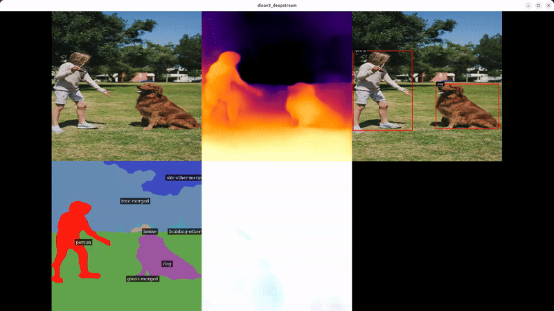

# dinov3_deepstream: DINOv3-based DeepStream application for real-time vision tasks

This repository provides a high-performance C++/CUDA application for performing multiple vision tasks—such as object detection, semantic segmentation, depth estimation, and optical flow—using Meta's [DINOv3](https://github.com/facebookresearch/dinov3) as the backbone with NVIDIA DeepStream SDK. A key advantage of this approach is that the DINOv3 backbone features are computed only once (the most computationally demanding step), and these shared features are then reused by lightweight task-specific heads. This design significantly reduces redundant computation and makes multi-task inference more efficient. In this version, inference is performed using NVIDIA DeepStream's TensorRT integration for maximum throughput.

This project complements [dinov3_ros](https://github.com/Raessan/dinov3_ros), providing a DeepStream-based alternative for production environments requiring maximum performance, hardware acceleration, and integration with NVIDIA Jetson or GPU-accelerated video pipelines.



## Table of Contents

1. [Features](#features)
2. [Installation](#installation)
3. [Docker](#docker)
4. [Usage](#usage)
5. [Tasks](#tasks)
6. [Architecture](#architecture)
7. [License](#license)
8. [References](#references)

## Features

- **Real-time multi-task inference**: Run detection, segmentation, depth, and optical flow simultaneously
- **Efficient backbone sharing**: DINOv3 features computed once and shared across all tasks
- **Hardware-accelerated pipeline**: Full GStreamer/DeepStream pipeline with CUDA/TensorRT
- **Flexible input sources**: Camera (V4L2), video files, RTSP streams, or generic URIs
- **Display modes**: Separate windows or tiled view for all inference heads
- **Low latency**: Optimized for real-time video analytics applications
- **Configurable**: Enable/disable tasks, adjust visualization, debug pipeline

## Installation

### Dependencies

1. **Install CUDA Toolkit**
   
   Follow the [NVIDIA CUDA installation guide](https://docs.nvidia.com/cuda/cuda-installation-guide-linux/index.html).

2. **Install DeepStream SDK**
   
   Download and install from [NVIDIA DeepStream](https://developer.nvidia.com/deepstream-sdk).

3. **Install GStreamer development libraries**
   
   Follow the [GStreamer installation guide](https://gstreamer.freedesktop.org/documentation/installing)

### Build the Application

```bash
git clone https://github.com/Raessan/dinov3_deepstream.git
cd dinov3_deepstream/dinov3_deepstream
mkdir build && cd build
cmake ..
make -j$(nproc)
```

The compiled binary will be located at `build/dinov3_deepstream`.

### Model Weights

You need to obtain model weights for both the DINOv3 backbone and the task-specific heads:

1. **DINOv3 Backbone**: Request and download weights from the [official DINOv3 repo](https://github.com/facebookresearch/dinov3). Export the model to ONNX/TensorRT format compatible with DeepStream.

2. **Task-specific Heads**: This repo contains the ONNX models of each subtask. They can also be obtained from the following repositories (trained with `vits16plus` backbone):
   - Detection: [object_detection_dinov3](https://github.com/Raessan/object_detection_dinov3)
   - Segmentation: [semantic_segmentation_dinov3](https://github.com/Raessan/semantic_segmentation_dinov3)
   - Depth: [depth_dinov3](https://github.com/Raessan/depth_dinov3)
   - Optical Flow: [optical_flow_dinov3](https://github.com/Raessan/optical_flow_dinov3)
Users are encouraged to improve the performance of any task by training and using their own ONNX models!

## Docker

Docker support with NVIDIA Container Toolkit is available for simplified deployment.

### Prerequisites

1. Install the [NVIDIA Container Toolkit](https://docs.nvidia.com/datacenter/cloud-native/container-toolkit/latest/install-guide.html) on the host machine.

### Build and Run

```bash
docker compose build
docker compose up
```

Access the container:
```bash
docker exec -it dinov3_deepstream bash
```

## Usage

### Basic Usage

Run the application from the `build` directory:

```bash
./dinov3_deepstream [OPTIONS]
```

### Command-line Options

- `--source-type TYPE`: Input source type: `camera`, `file`, `rtsp`, `uri` (default: `camera`)
- `--source-uri URI`: Source URI (device path, file path, or stream URL)
  - Camera: `/dev/video0`
  - File: `/path/to/video.mp4` or `./video.mp4` (absolute or relative paths)
  - RTSP: `rtsp://192.168.1.100:8554/stream`
- `--framerate FPS`: Frame rate for processing (default: `30`)
- `--display-mode MODE`: Display mode: `separate`, `tiled` (default: `tiled`)
- `--do-depth [true|false]`: Enable/disable depth estimation (default: `true`)
- `--do-detection [true|false]`: Enable/disable object detection (default: `true`)
- `--do-segmentation [true|false]`: Enable/disable segmentation (default: `true`)
- `--do-optical-flow [true|false]`: Enable/disable optical flow (default: `true`)
- `--debug [true|false]`: Enable debug mode with pipeline visualization (default: `false`)
- `--dot-file PATH`: Path for pipeline DOT file (default: `./pipeline`)
- `--config CONFIG`: Path to DINOv3 config file (overrides default)
- `--rtsp-output [true|false]`: Enable/disable streaming via RTSP (default: `true`)
- `--rtsp-port PORT`: RTSP server listening port (default: `554`)
- `--rtsp-mount PATH`: RTSP stream mount path (default: `/ds-test`)
- `-h, --help`: Show help message

### Examples

**Run RTSP streaming with tiled visual output (default):**
```bash
./dinov3_deepstream --source-type file --source-uri /path/to/video.mp4 \
  --rtsp-output true --rtsp-port 554 --rtsp-mount /ds-test --display-mode tiled
```

**Run RTSP streaming with separate individual mounts:**
When `--rtsp-output` is enabled, any active model head will also automatically stream to its own RTSP endpoint on port 554:
* Tiled/Original View: `rtsp://<host_ip>:554/ds-test`
* Depth Estimation: `rtsp://<host_ip>:554/depth`
* Object Detection: `rtsp://<host_ip>:554/detection`
* Segmentation: `rtsp://<host_ip>:554/segmentation`
* Optical Flow: `rtsp://<host_ip>:554/optical-flow`

To verify streaming via `gst-launch-1.0`:
```bash
gst-launch-1.0 rtspsrc location=rtsp://127.0.0.1:554/ds-test ! rtph264depay ! h264parse ! fakesink num-buffers=10
```

**Run with USB camera (all tasks enabled locally):**
```bash
./dinov3_deepstream --source-type camera --source-uri /dev/video0 --rtsp-output false
```

**Process a video file with only depth and segmentation:**
```bash
./dinov3_deepstream --source-type file --source-uri /path/to/video.mp4 \
  --rtsp-output false --do-detection false --do-optical-flow false
```

**Stream from RTSP source with tiled display locally:**
```bash
./dinov3_deepstream --source-type rtsp \
  --source-uri rtsp://192.168.1.100:8554/stream \
  --rtsp-output false --display-mode tiled
```

**Debug mode (generate pipeline visualization):**
```bash
./dinov3_deepstream --debug true --dot-file ./debug/pipeline
# Convert DOT file to image:
dot -Tpng ./debug/pipeline.dot -o ./debug/pipeline.png
```

### Configuration Files

Model inference settings are configured via text files in `dinov3_deepstream/configs/`:

- `config_infer_dinov3.txt`: DINOv3 backbone configuration
- `config_infer_depth.txt`: Depth head configuration
- `config_infer_detection.txt`: Detection head configuration
- `config_infer_segmentation.txt`: Segmentation head configuration
- `config_infer_optical_flow.txt`: Optical flow head configuration

These files specify model paths, input dimensions, layer names, and TensorRT engine parameters. Update them according to your model files and requirements.

## Tasks

Meta has only released model heads for the large ViT-7B backbone, so for smaller backbones we trained task-specific heads (each < 5M parameters) in separate repositories to achieve good precision. Our goal was not to beat SOTA models, but to provide a lightweight, plug-and-play toolkit.

Each task is implemented as a DeepStream probe that processes the inference output and performs visualization. The backbone produces shared features that are fed to all task-specific heads, minimizing redundant computation.

### Object Detection

Object detection using a lightweight FCOS-style detection head. Outputs bounding boxes with class labels and confidence scores.

Check the following repo: [object_detection_dinov3](https://github.com/Raessan/object_detection_dinov3)

**Implementation**: [src/probes/dinov3_probe.cpp](dinov3_deepstream/src/probes/dinov3_probe.cpp)
**Parser**: [src/custom_parsers/nvdsinfer_custom_detection.cpp](dinov3_deepstream/src/custom_parsers/nvdsinfer_custom_detection.cpp)

### Semantic Segmentation

Pixel-wise classification producing semantic masks. Includes a custom colorizer for visualization with class labels.

Check the following repo: [semantic_segmentation_dinov3](https://github.com/Raessan/semantic_segmentation_dinov3)

**Implementation**: [src/probes/segmentation_probe.cpp](dinov3_deepstream/src/probes/segmentation_probe.cpp)
**CUDA kernels**: [src/utils_cuda/segmentation.cu](dinov3_deepstream/src/utils_cuda/segmentation.cu)

### Depth Estimation

Monocular depth estimation producing metric depth maps. Visualized as colored depth maps with configurable near/far range.

Check the following repo: [depth_dinov3](https://github.com/Raessan/depth_dinov3)

**Implementation**: [src/probes/depth_probe.cpp](dinov3_deepstream/src/probes/depth_probe.cpp)
**CUDA kernels**: [src/utils_cuda/depth.cu](dinov3_deepstream/src/utils_cuda/depth.cu)

### Optical Flow

Dense optical flow estimation between consecutive frames. Visualized as colored flow fields using HSV color encoding.

Check the following repo: [optical_flow_dinov3](https://github.com/Raessan/optical_flow_dinov3)

**Implementation**: [src/probes/optical_flow_probe.cpp](dinov3_deepstream/src/probes/optical_flow_probe.cpp)
**CUDA kernels**: [src/utils_cuda/optical_flow.cu](dinov3_deepstream/src/utils_cuda/optical_flow.cu)

## Architecture

The application uses a GStreamer pipeline built with NVIDIA DeepStream components:

```
Source → nvstreammux → nvinfer (backbone) → tee
                                              ├→ nvinfer (depth) → probe → sink
                                              ├→ nvinfer (detection) → probe → sink
                                              ├→ nvinfer (segmentation) → probe → sink
                                              └→ nvinfer (optical_flow) → probe → sink
```

**Key components:**

1. **Source**: `v4l2src`, `uridecodebin`, or `rtspsrc` depending on input type
2. **nvstreammux**: Batches frames for inference (batch size = 1 by default)
3. **nvinfer (DINOv3 backbone)**: Runs once to extract shared features
4. **tee**: Splits the feature stream to multiple task heads
5. **nvinfer (task heads)**: Lightweight inference for each task
6. **Probes**: Custom GStreamer probes for post-processing and visualization
7. **Sinks**: Display outputs (separate windows or tiled mosaic)

The pipeline builder ([src/pipeline/pipeline_builder.cpp](dinov3_deepstream/src/pipeline/pipeline_builder.cpp)) dynamically constructs the pipeline based on enabled tasks.

### Comparison with dinov3_ros

| Feature | dinov3_deepstream | dinov3_ros |
|---------|-------------------|------------|
| **Framework** | NVIDIA DeepStream + GStreamer | ROS 2 |
| **Language** | C++/CUDA | Python |
| **Use Case** | Production video analytics, edge devices | Research, robotics integration |
| **Latency** | Lower (hardware pipeline) | Higher (Python overhead) |
| **Deployment** | Standalone application | ROS 2 node ecosystem |
| **Flexibility** | Fixed pipeline | Topic-based composition |

Both projects share the same task-specific head models and DINOv3 backbone weights.

